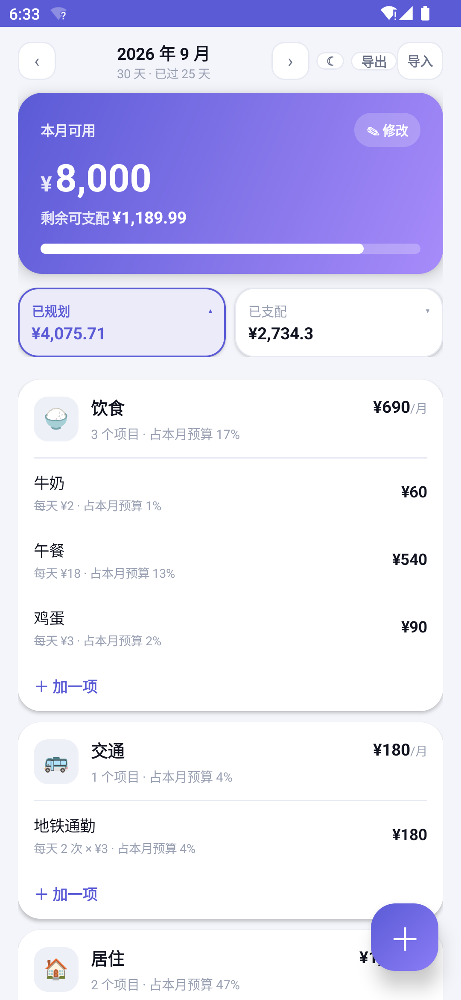
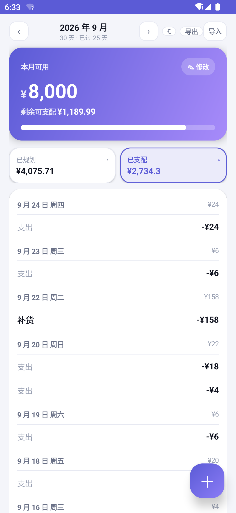
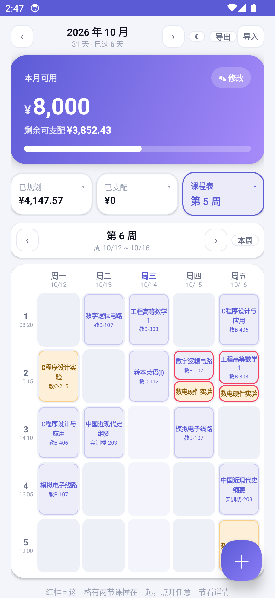
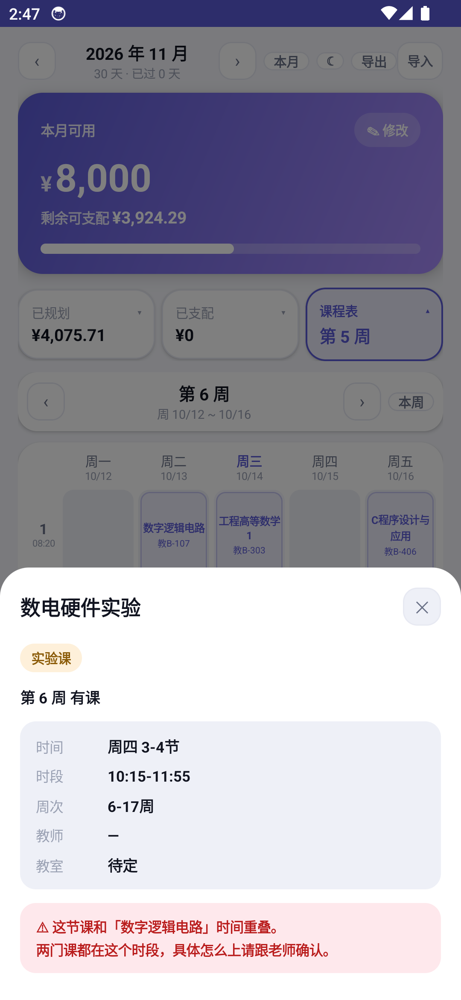
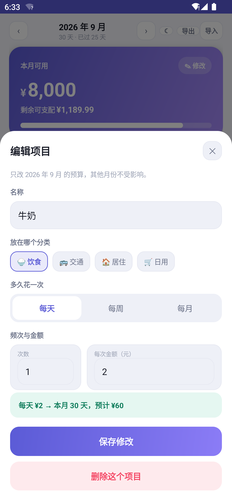
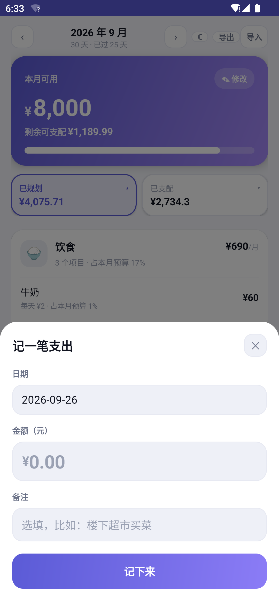

# 预算本 + 课程表

一个自己用的安卓小工具，两件事：

1. **记账** —— 先定预算、再记每天。核心不是流水账，而是把每天/每周/每月的固定开销写成预算项目，自动推算出这个月一共要花多少钱。比如写下「每天的牛奶 2 元」，它会自动告诉你这个月牛奶要 60 元。
2. **课程表** —— B24级通信工程（4）班的课表，按周查看，自动定位到本周，时间冲突会标红。

纯原生 Android，一个第三方库都没有，**APK 只有 67 KB**，**一个权限都不申请**。

| 规划视图 | 流水视图 | 课程表 |
| --- | --- | --- |
|  |  |  |

| 课程详情 | 编辑分类 | 编辑项目 | 记一笔 |
| --- | --- | --- | --- |
|  |  |  |  |

---

## 装到安卓手机（推荐）

到 [Releases](../../releases/latest) 下载最新的 APK（形如 `budget-book-v3.0.apk`）：

1. 把 APK 传到手机 —— 微信/QQ 发给自己、数据线拷贝、网盘都行
2. 手机上点开这个文件安装
3. 如果提示「不允许安装未知来源应用」，去 设置 → 应用 → 特殊权限 → 安装未知应用，允许你的浏览器/文件管理器安装，然后重试

装好后桌面上就有「预算本」图标，点开即用，**完全离线**，不联网也能用。

- 包名 `com.budgetbook.app`，版本 `3.0`
- 支持 Android 7.0 及以上（minSdk 24）
- 体积 67 KB
- 界面是**纯原生**的，不套 WebView，打开速度跟系统自带应用一个水平
- **一个权限都不申请**（不联网、不读存储、不读联系人）

**升级安装**：新版本用同一个签名和包名，直接覆盖安装即可，数据不会丢，不用先卸载。

## 课程表

点汇总栏最右边那格（显示「第 N 周」）切过去。

- 学期基准：**2026-09-07 是第 1 周周一**，打开自动定位到当前周
- 周次条可以左右翻（1~20 周），点「本周」跳回来
- 5 个大节按仙林校区作息：08:20 / 10:15 / 14:10 / 16:05 / 19:00
- 蓝色卡片 = 理论课，橙色卡片 = 实验课
- **红框 = 这一格有两节课撞在一起**（比如第 6 周起，周四第 2 大节的「数字逻辑电路」和「数电硬件实验」）
- 点任意一节课看详情：时间、时段、周次、教师、教室，有冲突会写明和哪门课重叠

### 课表数据

来源是学校的班级课表，手工补了两门实验课后写死在 `Courses.java` 里：

| 补充的课 | 时间 | 教室 |
| --- | --- | --- |
| **数电硬件实验** | 6-17周 周四第2大节、周五第2大节；6-10周 周五晚上 | 待定 |
| **C程序设计实验** | 6-11周 周一第2大节；12-14周 周一第1、2大节（共 12 大节） | 教C-215（机房） |

> ⚠️ **数电硬件实验和两门正课时间重叠**：周四第2大节撞「数字逻辑电路」（6-15周），
> 周五第2大节撞「工程高等数学1」（6-13周）。App 里会标红并写明，
> 但**具体怎么上得跟老师确认** —— 通知里说的是"这两段空出来安排数电实验"，
> 没提原有正课怎么办。
>
> 数电实验的**教室和教师通知里没写**，所以显示「待定 / —」。知道了告诉我，我补上重新打包。

## 预算分两级：分类 > 项目

- **一级分类**才有图标，比如 🍚 饮食、🚌 交通、🏠 居住
- **二级项目**没有图标，放在分类里面，比如「饮食」下面放「牛奶」「鸡蛋」「午餐」

```
🍚 饮食                          ¥690/月
   3 个项目 · 占本月预算 17%
   ──────────────────────────────
   牛奶          每天 ¥2           ¥60
   午餐          每天 ¥18         ¥540
   鸡蛋          每天 ¥3           ¥90
   ＋ 加一项
```

- 分类的月预算 = 它下面所有项目加起来，分类不用单独填金额
- 点分类标题 → 改名 / 换图标 / 删除；点项目 → 改金额、改周期，也能换到别的分类
- 图标只给了 16 个常用的，不够用可以在「也可以直接输入任意表情」里自己输入任意表情

## 记账不用归类

记一笔只有**日期、金额、备注**三样，不用选分类。

预算那边是「计划」，流水那边是「实际」，首页把两者对起来看。

## 本月可用金额

在首页大卡片点「＋ 设置本月可用」，填上这个月一共能花多少（比如工资、生活费）。
填了之后首页那个大数字就是**还能花多少**，每记一笔就相应减少：

```
本月可用                      可用 ¥8,000 ✎
¥5,265.7
已花 ¥2,734.3 · 已规划 ¥4,075.71
[========进度条：已花 / 可用========]
```

- **还能花**（大数字）= 可用金额 − 已经花掉的，记一笔就少一点
- **已规划** = 各项预算加起来打算花多少
- 花超了会提示「已超支 ¥x」
- 不想设总额也行，点「不用总额度，只按项目合计」，这时大数字 = 预算合计 − 已花

## 规划每月沿用，支配每月刷新

这是整个应用最核心的一处逻辑，分两条线：

**规划（已规划 / 分类 / 项目）—— 每个月都是同一套**

- 你只需要写一次。翻到任何一个月（不管是往前还是往后），看到的都是同一套分类和项目
- 每个月只是一份「副本」：不动它就完事，动了才单独存一份，**只影响那个月**，
  其他月份一点不受影响。所以想调下个月，切过去改就行
- 唯一会自动变的是月总额 —— 因为「每天 2 元」这种东西要按当月天数算：
  9 月 30 天 → 牛奶 ¥60，10 月 31 天 → 牛奶 ¥62

**支配（流水）—— 每个月都是空的，重新记**

- 记账带日期，按日期自动分月。所以翻到 10 月，已支配从 ¥0 开始
- 在 10 月记的账只算在 10 月，9 月的数一动不动

> 这一条以前有过 bug：记账弹层的日期默认填「今天」，不管你在看哪个月。
> 结果翻到 10 月记一笔，这笔账会落回 9 月去。
> 现在的规则是：当月就用今天，别的月份把「今天几号」推到那个月（超出当月天数就取月末）。

## 电脑上用

双击 `index.html`，用任意现代浏览器打开。不需要安装、不需要联网。

## 手机上用（不想装 APK）

双击 `start-lan-server.bat`，窗口会打印一个形如 `http://172.24.6.177:8137` 的地址；
手机连**同一个 Wi-Fi** 用浏览器打开即可。第一次运行 Windows 可能弹防火墙提示，选「允许访问」。

> 这种方式电脑必须开着，而且电脑 IP 一变，手机上存的数据就等于「换了个网站」看不见了。

## 在电脑上看这个 App（安卓模拟器）

桌面上有个快捷方式 **「预算本（模拟器）」**，双击它会：
启动模拟器 → 自动装上最新的 `预算本.apk` → 打开应用。

第一次开机 30~60 秒，之后有快照，10 秒左右。关掉模拟器窗口就是关闭。

跑一趟会在项目根目录留一份 **`启动日志.txt`**，记录每一步和耗时。
**启动失败的话把这个文件发我**，里面会写清楚是卡在哪一步、模拟器报了什么错。

> 排查记录，免得以后再踩：
> 1. 启动器的 `.bat` **文件名和内容都必须是纯 ASCII**。中文文件名会让 cmd 报
>    「系统找不到指定的路径」直接什么都不发生；正文里的多字节字符则会在 `chcp`
>    之后打乱 cmd 的文件读取位置，把后面的命令整段吃掉。
> 2. 模拟器用 `-gpu swiftshader_indirect`（软件渲染）启动。这台机器上 host GPU
>    偶尔会报 `Failed to load opengl32sw` 然后起不来，软件渲染连续冷启动都稳。
> 3. 拉模拟器时**不能用管道接 stdout**：adb 在 server 没起来时会 fork 守护进程，
>    守护进程继承管道，Node 的 `spawnSync` 会一直等管道关闭而永久卡死。
>    所以脚本里 adb 的输出是写临时文件再读的。

---

## 界面就是一页，用汇总栏切换

没有底部导航、没有标签页。从上到下：

```
‹  2026 年 9 月  ›              ☾ 导出 导入      ← 顶栏压成一行
┌──────────────────────────────────────┐
│ 本月可用                       ✎ 修改  │
│ ¥8,000                               │
│ 剩余可支配 ¥1,056.99                  │  ← 本月可用 − 已规划 − 已支配
│ ▓▓▓▓▓▓▓▓▓▓▓▓▓▓▓▓▓▓▓▓▓░░░░░░░░░░░░░░   │  ← 已安排出去的占了多少
└──────────────────────────────────────┘

┌───────────────────┐ ┌───────────────────┐
│ 已规划 ▴          │ │ 已支配 ▾          │   ← 点这两格切换下面显示什么
│ ¥4,075.71         │ │ ¥2,867.3          │
└───────────────────┘ └───────────────────┘

（下面按选择切换：）

规划视图：
🍚 饮食                          ¥690/月
   3 个项目 · 占本月预算 17%
   ──────────────────────────────
   牛奶     每天 ¥2 · 占本月预算 1%    ¥60
   午餐     每天 ¥18 · 占本月预算 13%  ¥540
   鸡蛋     每天 ¥3 · 占本月预算 2%    ¥90
   ＋ 加一项

＋ 添加分类

流水视图：
今天                                  ¥133
   支出                            -¥33
   支出                           -¥100
9 月 24 日 周四                        ¥24
   支出                            -¥24
```

三个数字的含义：

| | 含义 |
| --- | --- |
| **本月可用** | 你自己填的总额度（工资 / 生活费），在大卡片上，点右上角 ✎ 修改 |
| **剩余可支配** | 本月可用 − 已规划 − 已支配，在大卡片上 |
| **已规划** | 各项预算加起来打算花多少。点它 → 看规划 |
| **已支配** | 实际花掉的钱，也就是支出的流水。点它 → 看流水 |

每个分类和每个项目后面都写着它占本月总预算的百分之几。

没设「本月可用」时，大卡片里会提示去设置。

## 预算怎么写

添加项目时选「多久花一次」：

- **每天** —— 比如牛奶 2 元 → 本月 30 天 × 2 = **¥60**（2 月就是 28 天 = ¥56，会自动跟着月份天数变）
- **每周** —— 比如超市采购每周 2 次、每次 150 元 → 本月约 4.29 周 × 300 = **¥1,285.71**
- **每月** —— 比如房租 1800 元 → **¥1,800**

再配上「次数」，就能表达「每周 2 次」「每天 2 趟地铁」这类情况。填写时下方会实时显示推算公式和结果，不用自己算。

## 数据在哪

全部存在你自己设备的本地，不上传任何服务器。

- APK 里：存在应用私有目录，卸载应用会一起删掉
- 网页版：存在浏览器 localStorage

两种方式的数据**不互通**（是两个独立的存储）。用顶部的「导出 / 导入」可以互相搬。

- **导出**：顶部「导出」按钮，下载一个 JSON 备份文件
- **导入**：顶部「导入」按钮，从备份恢复（会覆盖当前数据，会先确认）
- **重要数据请定期导出备份**

## 说明

- 顶部月份可以左右切换，看别的月份，或点「回到本月」
- 删除一个预算项目时，它下面的记账记录会保留为「未归类」，不会丢
- 预算页会提示有多少钱没归到任何预算项目里，点一下就能跳到流水去整理
- 深浅色主题跟随系统，也可以手动切换

---

## 改完代码重新打包

```bat
node build-apk.mjs            :: 重新打包，产物覆盖 预算本.apk
```

也可以直接双击 `打包APK.bat`。

依赖（本机已装好）：

| 需要 | 位置 / 版本 |
| --- | --- |
| JDK | `C:\Program Files\Eclipse Adoptium\jdk-21.0.11.10-hotspot` |
| Android SDK | `%LOCALAPPDATA%\Android\Sdk`（platform 34 + build-tools 34.0.0） |
| Gradle | `%LOCALAPPDATA%\gradle-8.9` |

**升级要注意**：重新打包用的是 `android/budgetbook.jks` 这个签名文件。
必须用同一个签名和包名，手机才会覆盖安装、数据才不丢。
**`android/budgetbook.jks` 和 `android/keystore.properties` 别删。**

### 代码结构

App 界面是**纯原生 Android** 写的（不再套 WebView），全部用系统自带控件拼，
没有引入任何第三方库，所以 APK 只有 60 KB：

```
android/app/src/main/java/com/budgetbook/app/
  MainActivity.java   ← 主界面：顶栏、月份条、大卡片、三个页签
  Sheets.java         ← 三个底部弹层：编辑预算项目 / 记一笔 / 设置本月可用
  Store.java          ← 数据存取（SharedPreferences + JSON）与全部计算
  Ui.java             ← 建视图的小工具（圆角、渐变、进度条、chip 折行）
  Palette.java        ← 浅色 / 深色两套配色
android/app/src/main/res/
  values/styles.xml   ← 弹层滑入滑出动画
  anim/               ← 动画定义
  mipmap-*/           ← 应用图标（由 node tools/make-icons.mjs 生成）
```

### 根目录的 index.html

那是**浏览器版**（电脑上双击就能用），功能和 App 一样，但是独立的另一套代码。
两边数据各存各的、**不互通**，用「导出 / 导入」可以互相搬。

### 为了验证界面，本机装了模拟器

位置：`%LOCALAPPDATA%\Android\Sdk`（模拟器）+ `%USERPROFILE%\.android\avd\budgettest`（虚拟机），
加起来约 3 GB。不想留可以删：

```bat
%LOCALAPPDATA%\Android\Sdk\cmdline-tools\latest\bin\avdmanager.bat delete avd -n budgettest
```

删掉之后，以后改完代码就没法先在我这边跑一遍验证，只能直接装到手机上试。

